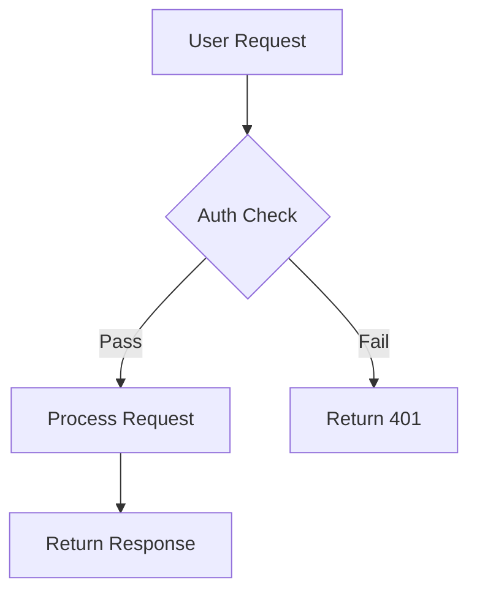
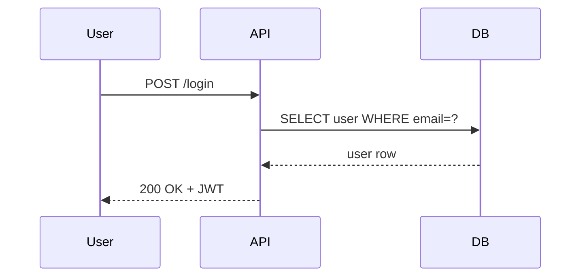
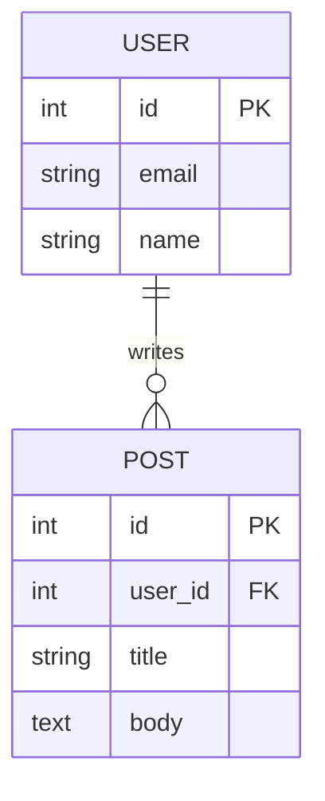
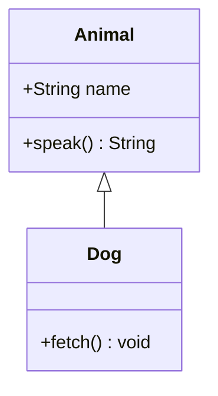
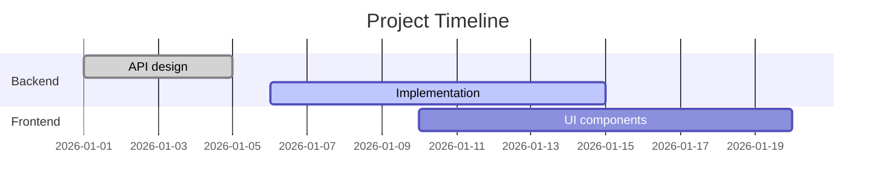
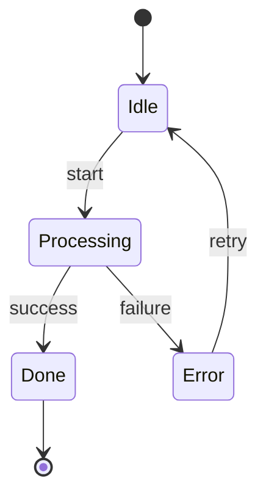
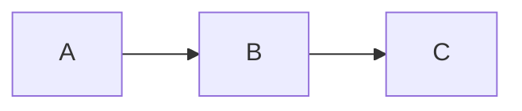

# Mermaid Diagrams

Create diagrams as plain text using [Mermaid](https://mermaid.js.org) syntax. Mermaid renders natively in GitHub READMEs, GitLab, Notion, VS Code (with extensions), Obsidian, and many documentation platforms — no image uploads, no external tools, no API keys.

## When to Use

Load this skill when asked to:
- Create a flowchart, architecture diagram, or system overview
- Draw a sequence diagram for an API flow or user journey
- Generate an entity-relationship diagram (ERD) for a database schema
- Make a Gantt chart for a project timeline
- Document class relationships or state machines

## Diagram Types

### Flowchart



**Save as:** `diagram.mmd` or embed in Markdown as a ` ```mermaid ` code block.

---

### Sequence Diagram



---

### Entity-Relationship Diagram (ERD)



---

### Class Diagram



---

### Gantt Chart



---

### State Diagram



---

## Workflow

### 1. Write the diagram

Use `write_file` to save a `.mmd` file:

```bash
write_file("architecture.mmd", """
flowchart LR
    Client --> LoadBalancer
    LoadBalancer --> API1
    LoadBalancer --> API2
    API1 --> Database
    API2 --> Database
""")
```

### 2. Embed in Markdown

To embed directly in a README or doc file, wrap in a fenced code block with the `mermaid` language tag:

````markdown

````

GitHub, GitLab, and Notion will render this automatically with no extra tooling.

### 3. Render locally (optional)

If the user has the Mermaid CLI installed:

```bash
# Install
npm install -g @mermaid-js/mermaid-cli

# Render to PNG
mmdc -i architecture.mmd -o architecture.png

# Render to SVG
mmdc -i architecture.mmd -o architecture.svg

# Render with custom theme
mmdc -i architecture.mmd -o architecture.svg -t dark
```

Check availability first:

```bash
if command -v mmdc &>/dev/null; then
    echo "Mermaid CLI available: $(mmdc --version)"
else
    echo "Mermaid CLI not installed. Diagram saved as .mmd for browser/editor rendering."
fi
```

### 4. Preview in browser (no install)

Direct the user to paste the diagram at:
- **https://mermaid.live** — official live editor with real-time preview
- **https://github.com** — paste in any issue, PR, or README comment

## Pitfalls

- **Indentation matters** — use consistent 4-space indentation inside diagram blocks.
- **Special characters in labels** — wrap labels containing `()`, `[]`, or `{}` in quotes: `A["label (detail)"]`.
- **Long labels** — use `<br/>` for line breaks inside node labels: `A["First line<br/>Second line"]`.
- **Subgraphs** — must be closed with `end`:
  ```
  subgraph Backend
      API --> DB
  end
  ```
- **Sequence diagram arrows** — `->>` is solid (sync call), `-->>` is dashed (response). Don't mix them up.
- **GitHub rendering** — GitHub renders Mermaid in Markdown files and issue comments but NOT in raw `.mmd` files viewed directly. For GitHub, always embed in a Markdown file.

## Quick Reference

| Diagram type | Keyword |
|---|---|
| Flowchart | `flowchart TD` / `flowchart LR` |
| Sequence | `sequenceDiagram` |
| Class | `classDiagram` |
| State | `stateDiagram-v2` |
| ERD | `erDiagram` |
| Gantt | `gantt` |
| Pie chart | `pie` |
| Mindmap | `mindmap` |
| Timeline | `timeline` |
